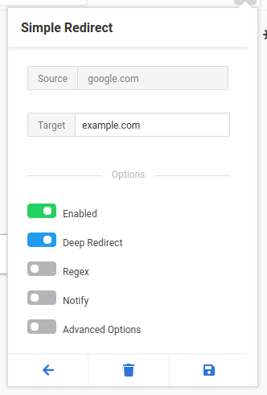

<!-- @format -->

# Simple Redirect

Simply redirect requests from one url to another

# Features

- Simple and easy to use interface
- Add, Remove, Edit redirection rules
- Deep Redirects - Redirect background third party requests as well
- Regex Matching - Match and replace requests via regex
- Notification - Selectively set/unset notifications for each redirect
- Header Copy - Pass POST variables in GET request

# Development

#### Clone repository

```sh
git clone https://gitlab.com/Antiquete/simple-redirect
```

#### Install Dependencies

```sh
npm install
```

#### Build

```sh
npm run build
```

#### Package

```sh
npm run package
```

Zip file is generated inside zips directory.

#### Live Development Mode

```sh
npm run run:dev
```

Run a live instance of extension that reloads automatically on source code change.

#### Other NPM Scripts

- Lint - Check for errors
- Watch - Build automatically on source code change. (This step is included in run:dev)

# Screenshots

##### On start,

  
  
##### After adding a few redirects,
  
  
  
##### On disabling a redirect,

  
  
##### Redirect reddit to old reddit using Regex,
  
  
  
##### Redirect all background google requests to example.com using Deep Redirects,
  
  
  
##### Header Copy in action, passing POST variables to GET request while redirecting from DuckDuckGo Non-JS to DuckDuckGo JS,
  
  

# Contributing

Any contributions or suggestions are welcome. If you are encountering a bug or need a new feature open an issue on git repository. If you have already implemented a fix or a new feature and want it merged, send me a pull request. Thanks.

# License

GPLv3
