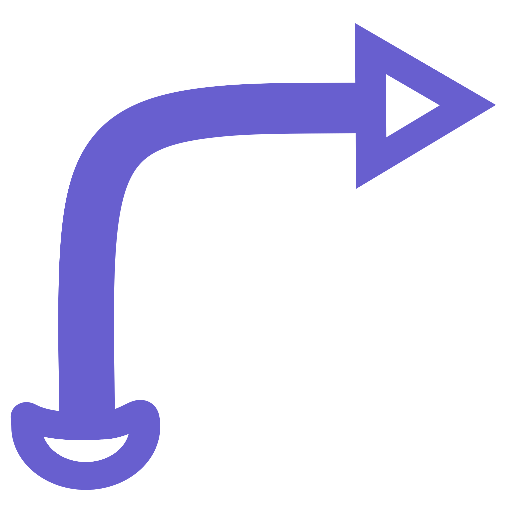

# Simple Redirect

Simply redirect requests from one url to another

# Features
- Simple and easy to use interface
- Add, Remove, Edit redirection rules
- Deep Redirect - Redirect background third party requests as well
- Notify on a redirect

# Development

#### Clone repository
```sh
git clone https://gitlab.com/Antiquete/simple-redirect
```

#### Install Dependencies
```sh
npm install
```

#### Build
```sh
npm run build
```

#### Package
```sh
npm run package
```
Zip file is generated inside release directory.

# Screenshots
##### On start,
  
  
  
##### After adding a few redirects,
  
  
  

# Contributing
Any contributions or suggestions are welcome. If you are encountering a bug or need a new feature open an issue on git repository. If you have already implemented a fix or a new feature and want it merged, send me a pull request. Thanks.

# License
GPLv3